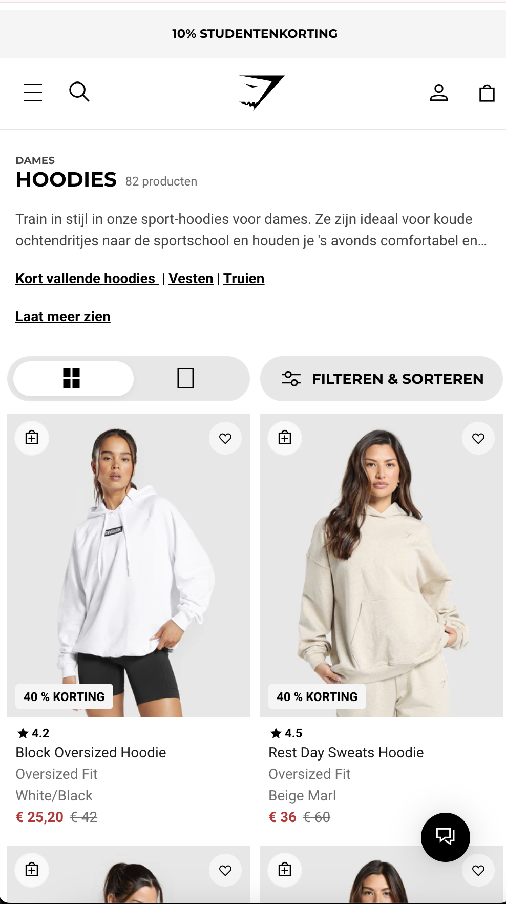
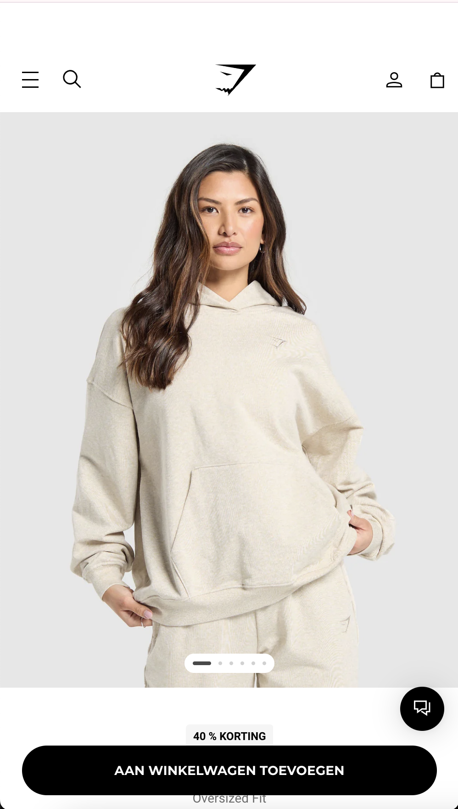
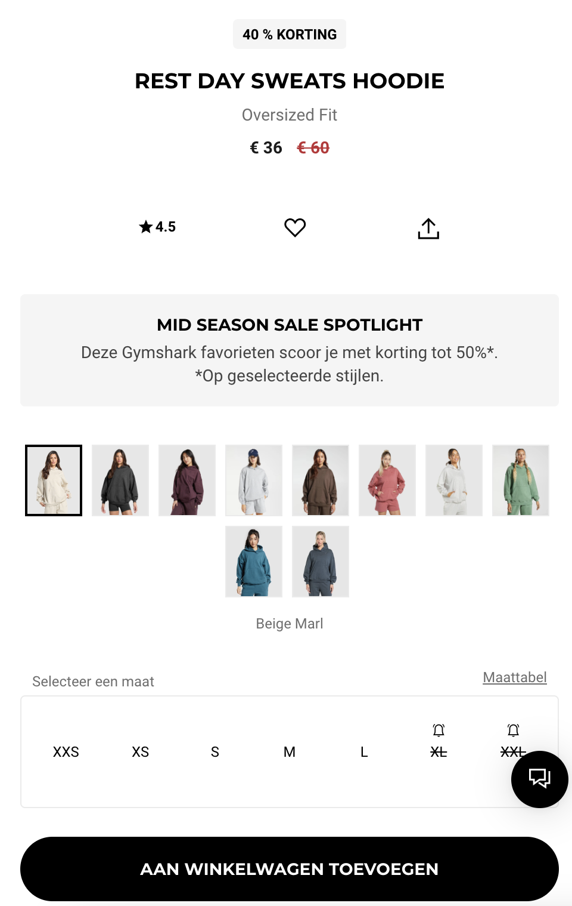
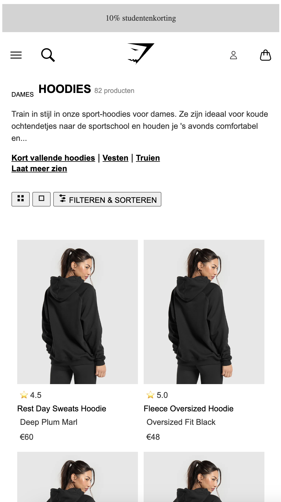

# Procesverslag
Markdown is een simpele manier om HTML te schrijven.  
Markdown cheat cheet: [Hulp bij het schrijven van Markdown](https://github.com/adam-p/markdown-here/wiki/Markdown-Cheatsheet).

Nb. De standaardstructuur en de spartaanse opmaak van de README.md zijn helemaal prima. Het gaat om de inhoud van je procesverslag. Besteedt de tijd voor pracht en praal aan je website.

Nb. Door *open* toe te voegen aan een *details* element kun je deze standaard open zetten. Fijn om dat steeds voor de relevante stuk(ken) te doen.

## Jij

  
uitwerken voor kick-off werkgroep

  ### Auteur:
  Sarah Bouziane

  #### Je startniveau:
  Blauw

  #### Je focus:
  responsive
 

## Je website

  
uitwerken voor kick-off werkgroep

  ### Je opdracht:
  (https://nl.gymshark.com/collections/hoodies/womens?canonicalColour=pink%2Cblack)

  #### Screenshot(s) van de eerste pagina (small screen): 
  hier de naam van de pagina  
  

  #### Screenshot(s) van de tweede pagina (small screen):
  hier de naam van de pagina  
  
  
 

## Toegankelijkheidstest 1/2 (week 1)

  
uitwerken na test in 2e werkgroep

  ### Bevindingen
  Beperkingen zijn niet alleen wat je ziet met het blote oog.
  De 2 gastspreekers hebben aangegeven waar wij op moeten letten. 
  Opties voor een bericht/email ipv bellen!
  screenreader moet duidelijk zijn zodat de persoon duidelijk kan navigeren.

## Breakdownschets (week 1)

  
uitwerken na afloop 3e werkgroep

  ### de hele pagina: 
  

  ### dynamisch deel (bijv menu): 
  

  ### wellicht nog een dynamisch deel (bijv filter): 
  

## Voortgang 1 (week 2)

  
uitwerken voor 1e voortgang

  ### Stand van zaken
  Ik weet wat ik wil namaken. Ik weet ook wat in de zin van toegankelijkheid belangrijk is om mee te nemen en hoe een screenreader werkt. Ik ben een beetje verwaald. Ik weet niet waar ik moet beginnen en hoe ik mijn html en correct in ga zetten. Ik durf niet veel vragen te stellen en te communiceren, waar ik echt overheen moet komen.

  ### Agenda voor meeting
  We gaan gewoon omste beurt onze vragen stellen.

  ### Verslag van meeting
  - aria current en label 
  - gebruik maken van flex
  - letten op taal van site en taal van code
binnen een element lang = 'en'
deel worden eng in een span
afkorting<abbr title= "hele woord">KLM ( voor screenreaders )
time etc in html aanpassen
section gebruiken ook om ul
kopje wat je niet ziet maar wel voorgelzen moet worden hide content A11Y
Section > ul > li > article

## Voortgang 2 (week 3)

  
uitwerken voor 2e voortgang

  ### Stand van zaken
  Ik loop achter. Ik weet niet hoe ik verder kom. In de klas kan ik prima meedoen en snap ik het ook gewoon, maar zodra ik alleen thuis zit lukt het niet. Ik ben er achter gekomen dat het komt doordat ik niet genoeg codeer, maar ik vind het echt moeilijk om alleen te doen.

  ### Agenda voor meeting
  Zelfde als vorige week. iederen stelt een vraag.

  ### Verslag van meeting
  Ik heb een persoonlijk gesprek gehad omdat ik de groeps gesprek had gemist.
  Weer was het prima als iemand naast mij zat en kon ik het volgen.Heb mijn menu kunnen maken. Ook heb ik responisveness op mijn productenlijst kunnen zetten. Dat was het. Ik kom niet verder.

## Toegankelijkheidstest 2/2 (week 4)

  
uitwerken na test in 9e werkgroep

  ### Bevindingen

## Voortgang 3 (week 4)

  
uitwerken voor 3e voortgang

  ### Stand van zaken
  Ik heb mij gefocust op vormgeving 2 puur omdat ik dat wel makkelijk alleen kon afmaken. Ik heb eigenlijk een beetje opgegeven als het gaat om mijn code. Er is alleen voorgang als ik naast iemand zit. Ik probeer het oprecht alleen, maar er komt gewoon niks uit. Ik raak in een blank state ofzo.

  ### Agenda voor meeting
  Ik ga meeluisteren naar feedback van anderen en dingen meenemen die voor mij belangrijk kunnen zijn

  ### Verslag van meeting
Notes:
Niet vergeten

Custom properties

Light/dark mode

*Nette code*
States interactiviteit.

Geleerd:
Tabel maken 

<table>
<th>
<tr>
<td> data

Class visiually hidden om een tabel te hiden from view

Foto die veranderd als je scherm groter maakt
Aspect-ratio:3/5 (andere manier om iets een hoogte en breedte te geven.) vaste verhouding
Object-fit: cover;

Media ( width > 30em) 

Etc.

GITHUB CHECKEN EN UPDATEN ( GEEN HOOFDLETTERS)

Html

<label>
<input type=“checkbox”> klik mij aan
</label>

Css

Label
Display flex

Align items center

Gap

type=“checkbox”

Margin: 0

Color-scheme: light-dark;—accent-color: light-dark(red, yellow);

Of

@media ( prefers-colour-sceme:dark) {
 —accent-color:yellow; 
}

## Eindgesprek (week 5)

  
uitwerken voor eindgesprek

  ### Je uitkomst - karakteristiek screenshots:
  

  ### Dit ging goed/Heb ik geleerd: 
  Korte omschrijving met plaatjes

  

  ### Dit was lastig/Is niet gelukt:
  Korte omschrijving met plaatjes

  

## Bronnenlijst

  
continu bijhouden terwijl je werkt

  Nb. Wees specifiek ('css-tricks' als bron is bijv. niet specifiek genoeg). 
  Nb. ChatGpT en andere AI horen er ook bij.
  Nb. Vermeld de bronnen ook in je code.

  1. svg voor raster lijst en filteren en sorteren via chatgpt grvraagd.
  fotos bronnen: 

  2. bron 2
  3. ...

